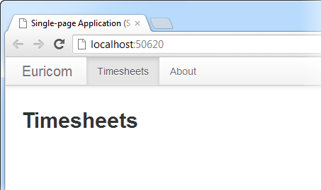
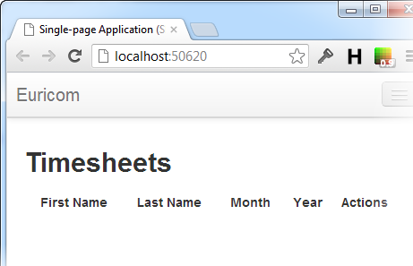
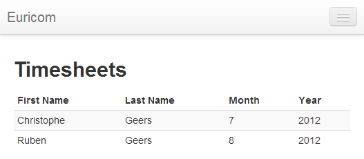

# Single-page Application with Knockout.js, Part 1

## Introduction

The last two posts were introductory posts to [Twitter Bootstrap](https://github.com/geersch/TwitterBootstrap) and [MongoDB](https://github.com/geersch/GettingStartedWithMongoDB). Let's combine these two technologies with ASP.NET MVC 4, Web API and Knockout.js to create a simple Single-page Application.

The goal is to fit all the necessary code - HTML, JavaScript and CSS on one single page, hence the name. This results in a more fluid user experience. We will not be doing any full page reloads or transfer control to another page. All interaction with the server will consist solely out lightweight JSON communication.

## Project Template

The last two posts discuss how you can quickly bootstrap a site and get up and running with MongoDB. To avoid repeating these steps I created an ASP.NET MVC 4 project which already contains a Bootstrap enabled layout and a REST service (Web API) which uses a MongoDB database to store and fetch its resources.

Download the solution and open it in Visual Studio.

[Single-page Application Project](https://dl.dropbox.com/u/40603470/SinglePageApplication.zip)

Before you compile and run the project make sure you've [set up MongoDB](https://github.com/geersch/GettingStartedWithMongoDB) correctly.

When you compile and run the application you should get the following page:



The site contains a [basic navbar](http://twitter.github.com/bootstrap/components.html#navbar) which contains two menu items, Timesheets and About. The About page just contains some [Lorem Ipsum](http://www.lipsum.com/) speak. We'll be focussing on the Timesheets page for our SPA application.

Apart from using Twitter Bootstrap, I also included a couple of JavaScript libraries such as jQuery, jQuery Validation and ofcourse the latest version of [Knockout.js](http://knockoutjs.com/).

## Timesheets API

Our SPA will be a simple [CRUD](http://en.wikipedia.org/wiki/Create,_read,_update_and_delete) application which allows the user to manage timesheets. Now a timesheet in our case in a very simple object.

```csharp
public class Timesheet : Entity
{
    public string FirstName { get; set; }

    public string LastName { get; set; }

    public int Month { get; set; }

    public int Year { get; set; }
}
```

Per timesheet you can specify a name, month and year. That's it, very basic. We won't go as far as to specify individual days per month. That's beyond the scope of this article. Let's keep it simple.

As you can see, the Timesheet object descends from the Entity base class.

```csharp
public abstract class Entity
{
    public ObjectId Id { get; protected set; }
}
```

Nothing special here, it just contains one property, namely the ObjectId that comes with each document in a MongoDB collection. Check out the post "[An Introduction to MongoDB](https://github.com/geersch/GettingStartedWithMongoDB)" for more information if required.

I used [Web API](http://www.asp.net/web-api) to create a TimesheetsController.

```csharp
public class TimesheetsController : ApiController
{
    private readonly MongoDatabase _mongoDb;
    private readonly MongoCollection<Timesheet> _repository;

    public TimesheetsController()
    {
        var connectionString =
          ConfigurationManager.AppSettings["MongoDBTimesheets"];
        _mongoDb = MongoDatabase.Create(connectionString);

        _repository = _mongoDb.GetCollection<Timesheet>(
          typeof (Timesheet).Name);
    }

    //...
}
```

When an instance of the TimesheetsController is created it establishes a connection to MongoDB and creates a repository (MongoCollection) for our timesheets.

The controllers supports the default HTTP verbs:

- **GET**: Retrieve all (or one) timesheet
- **POST**: Add a timesheet
- **PUT**: Update a timesheet
- **DELETE**: Delete a timesheet

For example:

```csharp
// GET /api/timesheets/4fd63a86f65e0a0e84e510de
[HttpGet]
public Timesheet Get(string id)
{
    var query = Query.EQ("_id", new ObjectId(id));
    return _repository.Find(query).Single();
}
```

A very basic implementation of a REST API that uses MongoDB to persist its resources. Check out the source code if you are interested in seeing how the other HTTP verbs are implemented. A bit of Web API knowledge is required though, but there are plenty of good tutorials on that topic available.

**Remark**: If you download the code you'll notice that I use these two entities as the actual models of the MVC app. They are decorated with some data annotations and JSON.NET serialization attributes. You can split this up if you want to, to avoid any dependencies, and create your own dedicated models and entities. I just want to keep the project as simple as possible. The main purpose is to demonstrate Knockout.js.

## Data

We'll be demonstrating the data binding features of Knockout in a bit, but in order to bind some data, we actually need some data. So place the following code in your Index action of the HomeController and fire up the site.

```csharp
var mongoDb = MongoDatabase.Create(ConfigurationManager.AppSettings["MongoDBTimesheets"]);
var repository = mongoDb.GetCollection<Timesheet>(typeof(Timesheet).Name);
var timesheets = new List<Timesheet>
{
    new Timesheet { FirstName = "Christophe", LastName = "Geers", Month = 8, Year = 2012},
    new Timesheet { FirstName = "Ruben", LastName = "Geers", Month = 8, Year = 2012 }
};
foreach (var timesheet in timesheets)
    repository.Insert(timesheet);
```

This will populate the Timesheet collection with a couple of timesheets. Feel free to add as many as you like. Just delete the code after you are done. Voila, we've now got some data we can work with.

## A Simple List with Knockout.js

OK, we've got our skeleton application up and running. Let's display a simple list of timesheets using Knockout.js. Open up the Index.cshtml file in Visual Studio and add the following HTML to render a basic table.

```html
<table id="timesheets" class="table table-striped table-hover table-condensed">
  <thead>
    <tr>
      <th>First Name</th>
      <th>Last Name</th>
      <th>Month</th>
      <th>Year</th>
    </tr>
  </thead>
  <tbody></tbody>
</table>
```

This renders a basic table, using some [bootstrap CSS](http://twitter.github.com/bootstrap/base-css.html#tables), which has one row to display the column captions.



The actual rows containing the timesheets aren't being rendered yet. We'll get to them soon.

We now need to create a view model for our page. Add the following JavaScript at the bottom of the index.cshtml file.

```js
<script type="text/javascript">

$(function () {
    ko.applyBindings(viewModel);
    viewModel.loadTimesheets();
});

var viewModel = {
    timesheets: ko.observableArray([]),

    loadTimesheets: function () {
        //...
    }
};

</script>
```

Here you declare a view model which has one property, timesheets, which is an array. Using Knockout you instruct the application to observe this array.

timesheets: ko.observableArray(\[\])

This instructs Knockout to monitor the array for any changes. If you add or remove elements from the array then Knockout will automatically update any UI elements bound to this array.

Using jQuery you instruct Knockout to bind the view model (viewModel) to the page using the ko.applyBindings(viewModel) call. Once bound you instruct the view model to load the timesheets (viewModel.loadTimesheets()).

Let's bind the rows of our table to this array. Replace the <tbody> tag of the table with the following HTML.

```html
<tbody data-bind="foreach: viewModel.timesheets">
  <tr>
    <td data-bind="text: firstname"></td>
    <td data-bind="text: lastname"></td>
    <td data-bind="text: month"></td>
    <td data-bind="text: year"></td>
  </tr>
</tbody>
```

Notice the **data-bind** attribute on the row and cells. This is a HTML5 data- attribute used by Knockout to bind your data to DOM elements. First your instruct Knockout to render a row for each timesheet in the view model's timesheets array.

When a row is being rendered, the context switches from the view model to an individual timesheet object. Hence you can bind each cell of a row to the properties of a timesheet.

Timsheet object? This is the type of object we'll eventually add to the timesheets observable array. Let's define the object in JavaScript.

```js
function timesheet(timesheet) {
  this.id = ko.observable(timesheet.id);
  this.firstname = ko.observable(timesheet.firstname);
  this.lastname = ko.observable(timesheet.lastname);
  this.month = ko.observable(timesheet.month);
  this.year = ko.observable(timesheet.year);
}
```

A very simple JavaScript object, which initializes 5 properties (id, firstname, lastname...etc.) based on a timesheet object we pass into its "constructor". Now let's complete the loadTimesheets() function of our view model.

```js
loadTimesheets: function () {
    var self = this;
    $.getJSON(
        '@Url.RouteUrl("DefaultApi", new { httproute = "", controller = "timesheets" })',
        function (timesheets) {
            self.timesheets.removeAll();
            $.each(timesheets, function (index, item) {
                self.timesheets.push(new timesheet(item));
            });
        }
    );
}
```

A single $.getJSON call to our Timesheets API controller. This will perform a GET request and thus will be handled by the Get(...) method defined on the TimesheetsController. It will retrieve all of the timesheets and return them as JSON data.

```json
[
  { "firstname": "Christophe", "lastname": "Geers", "month": 7, "year": 2012 },
  { "firstname": "Ruben", "lastname": "Geers", "month": 8, "year": 2012 }
]
```

Once we receive this data we foreach over it and add an object to our observed array for each timesheet. If you refresh the page now you'll notice that Knockout automatically rendered a row for each of our timesheets and that each individual property is bound to its respective cell.



Nice huh? That concludes the first part of the series on Knockout.js. In the next part I'll start where we left off and show you how you can add timesheets using Knockout.js and Twitter Bootstrap's [modal](http://twitter.github.com/bootstrap/javascript.html#modals).
