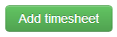
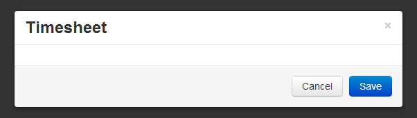
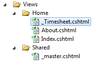
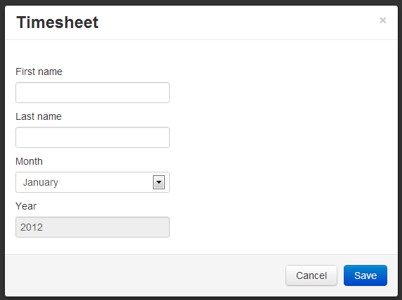
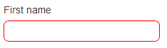
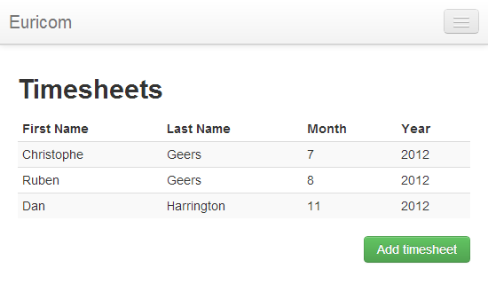

# Single-page Application with Knockout.js, Part 2

## Introduction

Let's start where we left off. Open the source code of the previous part in Visual Studio.

Last time we retrieved a list of timesheets, pushed it into an observable array and used declarative bindings (data-bind) to associate DOM elements with our view model. In other words we databound it to a table. Knockout then automagically rendered a row for each timesheet in the array.

Let's proceed with the next step in our little CRUD application and add support for creating new timesheets.

## Modal

Let's present the user with an option to add a new timesheet. Copy / paste the following HTML code just below the table on the Index.cshtml view.

```html
<div class="pull-right">
  <a
    id="new-timesheet"
    class="btn btn-success"
    data-toggle="modal"
    href="#timesheet-modal"
    >Add timesheet</a
  >
</div>
```

This will render the following button beneath the bottom right hand corner of the table.



This demonstrates some of Twitter Bootstrap's base CSS for quickly rendering cool looking [buttons](http://twitter.github.com/bootstrap/base-css.html#buttons).

The button here is a simple anchor. Notice the data-toggle and href attributes on the anchor? Bootstrap magic at work again. The data-toggle attribute basically tells Bootstrap to show a modal window with the id (href) "timesheet-modal" when the button is clicked. The button (data-)toggles the modal window.

Time to add the actual modal. Insert the following HTML beneath the button.

```html
<div class="modal hide fade" id="timesheet-modal">
  <div class="modal-header">
    <button type="button" class="close" data-dismiss="modal">×</button>
    <h3>Timesheet</h3>
  </div>

  <form
    id="Timesheet"
    data-bind="submit: 
       function(form) { postTimesheet(form, 'timesheet-modal') }"
  >
    <div class="modal-body"></div>

    <div class="modal-footer">
      <a href="#" class="btn" data-dismiss="modal">Cancel</a>
      <input type="submit" class="btn btn-primary" value="Save" />
    </div>
  </form>
</div>
```

The modal div is initially hidden due to the CSS hide class. It consists out of three parts, namely:

- header (modal-header)
- body (modal-body)
- footer (modal-footer)

Each part is decorated with a Bootstrap CSS class (modal-header, modal-body...etc.). The header contains a caption and a button (X) that allows the user to close the modal. The button's data-dismiss attribute informs bootstrap that this button closes the modal. The body is empty for now, while the footer contains a regular submit button and another button to close the modal.

Before you run the application there are two other things you need to modify.

First add the following CSS to the site.css file which is included between bootstrap.css and bootstrap-responsive.css to remove the bottom margin of 20px that bootstrap adds to forms. Notice that the modal's body and footer are wrapped in a form.

```html
form { margin: 0; }
```

This form is also bound to our view model.

```html
<form
  id="Timesheet"
  data-bind="submit: function(form) { postTimesheet(form, 'timesheet-modal') }"
>
  ...
</form>
```

This attribute instructs Knockout to call the view model's postTimesheet function when the form is submitted. Add this new function to the view model.

**Remark**: Notice that here I passed the ID of the modal to the submitTimesheet() function by wrapping the handler in a function literal that takes in the necessary parameters. Knockout supplies the form by default for form submissions, I just added a literal which contains the modal's ID. You'll see later on why we need it.

```js
postTimesheet: function (form, modalId) {

}
```

Alright, the modal is now completely setup. Compile and run. If you click on the "Add timesheet" button now, the modal window will appear.



Five minutes of work and you've got a working modal window!

## The Form

We can now add a form to the body of the modal which the user can fill in to add a new timesheet. Create a partial view called \_Timesheet.



Render the partial view in the modal's body.

```html
...
<div class="modal-body">
  @{ Html.RenderPartial("_Timesheet", new Timesheet()); }
</div>
...
```

The partial view \_Timesheet uses the Timesheet type as its model. It renders some input controls for the first name, last name, month and year properties.

```csharp
@model MvcApplication.Models.Timesheet

@Html.LabelFor(m => m.FirstName)
@Html.TextBoxFor(m => m.FirstName)
@Html.LabelFor(m => m.LastName)
@Html.TextBoxFor(m => m.LastName)

@Html.LabelFor(m => m.Month)
@Html.DropDownListFor(m => m.Month, Model.Months)
@Html.LabelFor(m => m.Year)
@Html.TextBoxFor(m => m.Year, new { disabled="disabled" })
```

**Remark**: If you take a look at the Timesheet model's code you'll notice that I added some data annotations (required, display...etc.) and an IEnumerable of SelectListItem for the months.

Your modal should now look like the following screenshot:



Let's add some CSS to the site.css file to make sure required fields are nicely marked with a red border.

```css
select.input-validation-error,
input.input-validation-error {
  border-color: #ff0000;
  border-radius: 7px;
}

select.input-validation-error:focus,
input.input-validation-error:focus {
  outline: none;
  border-color: #ff0000;
  box-shadow: 0 0 10px #ff0000;
}
```

If you submit the form without filling out a single field you'll notice that the first- and last name field will be marked as required.



## Resetting the Form

Close the modal and re-open it. What do you notice? Yup, the fields are still marked as required, red border and all. Same thing if you enter some data, it will be still there next time you re-open the modal. When opening the modal we need to wipe the slate clean; we need to reset the form.

Bind the "Add timesheet" button's click event to the view model's resetForm function as follows:

```html
<div class="pull-right">
  <a
    id="new-timesheet"
    class="btn btn-success"
    data-toggle="modal"
    href="#timesheet-modal"
    data-bind="click: resetForm.bind($data, 'Timesheet')"
  >
    Add timesheet</a
  >
</div>
```

We pass a literal parameter to the resetForm function using the [bind](https://developer.mozilla.org/en-US/docs/JavaScript/Reference/Global_Objects/Function/bind) function, which attaches a specific parameter value to a function reference. Here we pass the ID of the form which we want to reset.

As for the resetForm function's implementation, it's pretty straightforward. Just add the following function to your view model.

```js
resetForm: function (formId) {
    var form = $('#' + formId);
    form.validate().resetForm();
    form.get(0).reset();
}
```

Using jQuery validation the form's validation information is reset and the the actual form itself. If you re-open the modal now the fields are empty and no longer marked as required.

## POST-it

Everything is in place now. The form is finished, let's post the data entered by the user and create a new timesheet. Time to implement the view model's postTimesheet function we added earlier.

Let's go through it step by step. First we check if the form passes the required validation.

```js
form = $(form);
if (!form.valid()) return;
```

Then we extract the entered information form the form and serialize it as JSON.

```js
var json = JSON.stringify(this._getTimesheetFromFrom(form));
```

The \_getTimesheetsFromForm() is a "private" method on our view model which is implemented as follows:

```js
_getTimesheetFromFrom: function (form) {
    form = $(form);
    var timesheet = {};
    form.find('input[type!=submit],select').each(function () {
        timesheet[this.name] = $(this).val();
    });
    return timesheet;
}
```

It takes all the INPUT and SELECT input elements from the form and returns the information as a JSON object.

```json
{
  "FirstName": "Dan",
  "LastName": "Harrington",
  "Month": "11",
  "Year": "2012"
}
```

OK, let's continue with the implementation of the postTimesheet() function. The form's data has been validated, the JSON payload has been assembled. Time to POST the data to our Timesheets API controller (REST).

Easy Peasy Lemon Squeezy. Just perform an $.ajax call and POST the JSON data. When you get a reply, which is the newly added timesheet serialized as JSON, we push it on our observable array of timesheets. Last, but not least we use the modalId parameter to hide the modal window.

```js
var self = this;
$.ajax({
  url: '@Url.RouteUrl("DefaultApi", new { httproute = "", controller = "timesheets" })',
  type: "POST",
  data: json,
  dataType: "json",
  contentType: "application/json; charset=utf-8",
  success: function (jsonObject) {
    self.timesheets.push(new timesheet(jsonObject));
    $("#" + modalId).modal("hide");
  },
});
```

Thanks to the magic of Knockout our list of timesheets will update automatically.



The previous post showed you how to implement the READ part of our CRUD application, while this part demonstrated the CREATE. In the third article of this series we'll reuse much of what we learned here and implement the UPDATE. The fourth and last post will wrap everything up with the DELETE.
