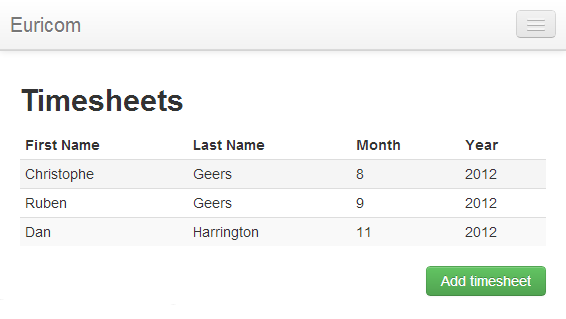
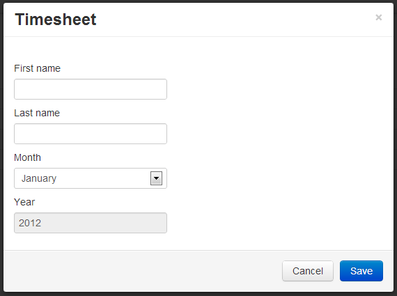

# Single-page Application with Knockout.js, Part 3

## Introduction

In part 3 of this series we'll implement another feature of our little Knockout.js powered CRUD application. We already talked about read and create in the first two articles, skim through them if you want to get up to speed.

- [Single-page Application with Knockout.js, Part 1](../part-1/README.md) (READ)
- [Single-page Application with Knockout.js, Part 2](../part-2/README.md) (CREATE)

The next logical step after enabling users to add timesheets is to allow them to edit the new records. Time to implement some update functionality.

## Edit Link

Start where we left off last time, with the source code of the previous part. Compile and run it. After adding a couple of timesheets you should see a similar list.



Let's make the first- and lastname clickable.

Open the Index.cshtml view, locate the table's body and replace the following two cells:

```html
<td data-bind="text: firstname"></td>
<td data-bind="text: lastname"></td>
```

with

```html
<td><a href="#" data-bind="text: firstname, click: edit"></a></td>
<td><a href="#" data-bind="text: lastname, click: edit"></a></td>
```

First we turned the first- and lastname into anchors. The text attribute of these anchors is bound to our timesheet objects as before. Then we hooked up the click events of both anchors to the edit() function of the timesheet object. Let's declare it.

```js
function timesheet(timesheet) {
  //...

  this.edit = function () {
    console.log(this.id());
    //...
  };
}
```

When editing a timesheet we'd like to know the ID of the timesheet. Easy, the edit() function will automatically be called on the correct timesheet object. This object already knows the ID of the timesheet.

```js
function timesheet(timesheet) {
  this.id = ko.observable(timesheet.id);
  //...
}
```

## ObjectId

On the server-side our Timesheet type descends from the abstract Entity class. This base class contains the Id property of type ObjectId. This is a MongoDB specific type provided by the [MongoDB C# driver](http://nuget.org/packages/mongocsharpdriver).

If you open the Entity.cs code file you'll notice that it is decorated with a couple of attributes.

```csharp
[JsonObject(MemberSerialization = MemberSerialization.OptIn)]
public abstract class Entity
{
    [JsonProperty(PropertyName = "id")]
    [JsonConverter(typeof(ObjectIdConverter))]
    public ObjectId Id { get; protected set; }
}
```

Nothing special here, just a few JSON.NET specific attributes to specify how to serialize the data. The only special case is the ObjectIdConverter attribute. It's a custom [JSON.NET converter](https://github.com/geersch/JsonNetDateTimeConverter) to help serialize the ObjectId.

The ObjectId is a 12-byte binary value consisting out of:

- 4-byte timestamp (seconds sinds epoch)
- 3-byte machine id
- 2-byte process id
- 3-byte counter

Check out the implementation of the custom converter if you want to. Nothing special, basically we just call ToString() on the ObjectId to retrieve a more readable format.

For example:

```sh
5079220fb4075a041495e119
50792206b4075a041495e118
50792218b4075a041495e11a
...
```

Voila, the last- and firstname have now been turned into anchors. When clicking upon them the edit() function of their coherent timesheet object will be called.

## Modal Form

When a user clicks edit we want the modal timesheet form to popup pre-populated with the selected timesheet's data. But first let us modify something that we introduced in the previous part, namely resetting the form.

The "Add timesheet" button is currently bound to the view model's resetForm() method. Go ahead and remove this binding.

```html
<a
  id="new-timesheet"
  class="btn btn-success"
  data-toggle="modal"
  href="#timesheet-modal"
  >Add timesheet</a
>
```

Now remove the entire resetForm() method from the view model. Just go ahead and delete it. We'll use one of the [modal's events](http://twitter.github.com/bootstrap/javascript.html#modals), provided by Bootstrap, to reset the form. Not only do we need to reset the form each time after we've added a timesheet, now we also need to reset after each modification.

Copy / paste the following JavaScript below your view model.

```js
$("#timesheet-modal").on("hide", function () {
  var form = $("#Timesheet");
  form.validate().resetForm();
  form.get(0).reset();
  form.removeData("timesheet");
  form.find("input[type='hidden'][id='id']").remove();
});
```

When the modal is hidden (hide event) it now resets the form. Doesn't matter if we were adding or modifying an existing timesheet. Each time the modal is hidden it will reset the Timesheet form. No need to manually call this code anymore each time you show the modal.

**Remark**: Notice that when resetting the form we also remove a hidden input element with the id 'id' (if present). This hidden stores the ID of the timesheet we're currently editing. We'll get back to this later.

Currently the modal timesheet form is only displayed when someone clicks the "Add timesheet" button, but we also want to show it when a user click upon the first- or lastname of a timesheet. To achieve this you need to correctly setup the anchors to trigger the modal.

Add the following two attributes to both the first- and lastname anchors:

```html
<a href="#timesheet-modal" data-toggle="modal" ...></a>
```

Now the modal will also be shown when you click upon the first- or lastname.



## Populating the Form

OK, the modal form is displayed when editing a timesheet, but the fields aren't filled in. Let's rectivy this.

Modify the click databinding of both anchors as follows:

```html
<a
  data-bind="text: firstname, click: function(form) { edit('Timesheet') }"
  ...
></a>
```

We still call the timesheet object's edit function, but now we pass in an additional parameter, namely the ID of the form.

Now we can link the timesheet object to the form using [jQuery's data() method](http://api.jquery.com/jQuery.data/).

```js
function timesheet(timesheet) {
  //...

  this.edit = function (formId) {
    var form = $("#" + formId);
    form.data("timesheet", this);
  };
}
```

Now when you click on one of the links the timesheet object will be associated with the form which resides in the modal.

We can easily pre-populate the form now using another one of the modal's events.

```js
$("#timesheet-modal").on("show", function () {
  var form = $("#Timesheet");
  var timesheet = form.data("timesheet");
  if (!timesheet) return;

  $("<input>")
    .attr("type", "hidden")
    .attr("id", "id")
    .attr("name", "id")
    .val(timesheet.id())
    .prependTo(form);
  form.find("#FirstName").val(timesheet.firstname());
  form.find("#LastName").val(timesheet.lastname());
  form.find("#Month").val(timesheet.month());
  form.find("#Year").val(timesheet.year());
});
```

When the modal form is shown we check if a timesheet object has been associated with the form. If so, we take use the timesheet object's properties to pre-populate the form with data. Note that we also add a hidden input element to the form which stores the timesheet's ID. This way we know which timesheet to update it when we submit the form.

## Submitting the Form

As you may remember the form's submission is already bound to the view modal's postTimesheet() function thanks to the magic that is Knockout. Let's modify this function so that it can handle adding (POST) and updating (PUT) timesheets.

```js
postTimesheet: function (form, modalId) {
    form = $(form);
    if (!form.valid())
        return;

    var json = JSON.stringify(this._getTimesheetFromFrom(form));

    var update = form.find("input[type='hidden'][id='id']").val();
    var httpVerb = !update ? "POST" : "PUT";

    var self = this;
    $.ajax({
        url: '@Url.RouteUrl("DefaultApi", new { httproute = "", controller = "timesheets" })',
        type: httpVerb,
        data: json,
        dataType: 'json',
        contentType: 'application/json; charset=utf-8',
        success: function (jsonObject) {
            if (update) {
                var match = ko.utils.arrayFirst(self.timesheets(), function (item) {
                    return jsonObject.id === item.id();
                });
                match.update(jsonObject);
            }
            else {
                self.timesheets.push(new timesheet(jsonObject));
            }
            $('#' + modalId).modal('hide');
        }
    });
}
```

Only a few things have changed. First we check if the form contains a hidden ID input element. If so we'll be updating (POST) a timesheet instead of adding (POST) one. Then when our Ajax call successfully returns we check if we need to add a new timesheet to our observable array or update an existing one.

Note that Knockout monitors an observable array for additions and removals of objects, but it doesn't actually monitor the properties of the objects that you've added to the array. Imagine how many resources it would require if it were to scan and monitor each object's entire graph.

We need to manually update the object the modified object which resides in the observable array. For this purpose I've added an update() method to the timesheet class.

```js
function timesheet(timesheet) {
  //...

  this.update = function (timesheet) {
    this.id(timesheet.id);
    this.firstname(timesheet.firstname);
    this.lastname(timesheet.lastname);
    this.month(timesheet.month);
    this.year(timesheet.year);
  };
}
```

After updating a timesheet we first locate it in the observable array and then call it's update method passing in the JSON object (= timesheet) which we received from our REST controller.

And that wraps up the third article of this Knockout.js series. The first post showed you how to implement the READ part, the second demonstrated the CREATE part and this one explained the UPDATE part. Only one remaining, namely DELETE, but I'll keep that one for the fourth and final part.
