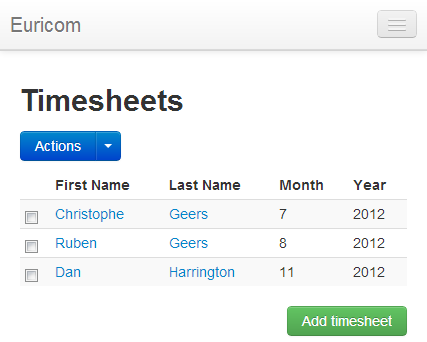

# Single-page Application with Knockout.js, Part 4

## Introduction

Let's wrap up our little Knockout powered single-page application. We already covered 3 out of 4 parts of the timesheets application.

- [Displaying a list of timesheets](../part-1/README.md)
- [Adding timesheets](../part-2/README.md)
- [Editing timesheets](../part-3/README.md)

Time to finish up with the fourth and final part, deleting timesheets. Using some Twitter Bootstrap and Knockout magic it shouldn't take that long.

## Button Dropdown

Bootstrap is awesome, you know that by now, right? Let's introduce another one of its components to help us delete timesheets. Open the source code of the previous part in Visual Studio.

Open the index.cshtml view and copy / paste the following HTML above the table displaying the timesheets.

```html
<div class="btn-toolbar" data-bind="visible: viewModel.timesheets().length > 0">
  <div class="btn-group">
    <span class="btn btn-primary">Actions</span>
    <a class="btn btn-primary dropdown-toggle" data-toggle="dropdown" href="">
      <span class="caret"></span>
    </a>
    <ul class="dropdown-menu">
      <li><a href="#">Delete</a></li>
    </ul>
  </div>
</div>
```

This displays a button dropdown above the table if there is at least one timesheet present in our observable array. Notice the data-bind attribute on the div.


The dropdown is toggled when you click on the caret. Like Bootstrap's modal it also has a data-toggle attribute. Currently our dropdown list only contains one item, but feel free to add more.


## Checkboxes

Alright, we have given the user an action which he can execute when he wants to delete one or more timesheets. But we still need them to be able to select the timesheets they want to delete. Adding a checkbox to each row will serve this purpose.

First add a new empty header cell to the `<thead>`. Make sure it is the first cell.

```html
<thead>
  <tr>
    <th></th>
    //...
  </tr>
</thead>
```

Then add a new cell to the row template. Also insert it before the other cells, so that it is nicely displayed beneath the empty header cell.

```html
<tbody data-bind="foreach: viewModel.timesheets">
  <tr>
    <td><input type="checkbox" data-bind="checked: selected" /></td>
    //...
  </tr>
</tbody>
```

Your layout should now resemble this:



Take a look at the cell which contains the HTML for the checkbox. Here we make use of the [checked binding](http://knockoutjs.com/documentation/checked-binding.html). The checkbox is linked to a property on its coherent timesheet object, called selected. Add this new property to the timesheet class.

```js
function timesheet(timesheet) {
  //...
  this.selected = ko.observable(false);
  //...
}
```

When the user checks the timesheet, the selected property on the timesheet object will be updated. This way each timesheet knows wether or not it is currently selected.

## Are You Sure?

When deleting data, it's best to ask the user if he is sure he wants to proceed. So when he selects one or more timesheets and clicks the delete action we want to alert him.

Add the following HTML to your page.

```html
<div class="modal hide fade" id="timesheet-delete">
  <div class="modal-header">
    <button type="button" class="close" data-dismiss="modal">×</button>
    <h3>Delete?</h3>
  </div>
  <div class="modal-body">
    <p>Are you sure you want to delete these timesheets?</p>
  </div>

  <div class="modal-footer">
    <a href="#" class="btn" data-dismiss="modal">Cancel</a>
    <input
      type="submit"
      class="btn btn-danger"
      value="Delete"
      data-bind="click: function() { deleteTimesheets('timesheet-delete') }"
    />
  </div>
</div>
```

That's right, another modal window. Initially hidden we'll show this popup when the user is about to delete timesheets. Let's hookup the delete action to this modal.

```html
<ul class="dropdown-menu">
  <li>
    <a id="new-timesheet" data-toggle="modal" href="#timesheet-delete"
      >Delete</a
    >
  </li>
</ul>
```

Now the delete action toggles the model through the data-toggle and href attributes.


If you take a look at the modal's HTML you'll notice that the Delete button is wired (data-bind) to the view model's deleteTimesheets() function. For now just add the following stub function to your view model.

```js
var viewModel = {
  //...
  deleteTimesheets: function (modalId) {
    //...
  },
};
```

## Nothing Selected?

Before we can actually delete timesheets, there's one little issue that we need to fix. Currently the delete action is also available when no timesheets have been selected. Let's disable it in this case. Add a new [computed observable](http://knockoutjs.com/documentation/computedObservables.html) to the view model.

```js
viewModel.timesheetsSelected = ko.computed(function () {
  var selected = 0;
  $.each(this.timesheets(), function (index, timesheet) {
    if (timesheet.selected()) selected++;
  });
  return selected;
}, viewModel);
```

This computed observable returns the number of selected timesheets. Let's hook up the visibility of the button dropdown to it. Just remove the old data-bind attribute and put the following one in its place.

```html
<div
  class="btn-toolbar"
  data-bind="visible: viewModel.timesheetsSelected() > 0"
>
  ...
</div>
```

Problem solved. Now the user can only select the Delete action if at least one timesheet has been selected. You might want to hook up the computed observable directly to the Delete action instead of hiding the whole dropdown, feel free to experiment.

## Delete

We're only one Ajax call away from deleting the timesheets and completing our timesheets application. So without further ado, here's the implementation for the deleteTimesheets() function.

```js
deleteTimesheets: function (modalId) {
    var ids = new Array();
    $.each(this.timesheets(), function (index, timesheet) {
        if (timesheet.selected())
            ids.push(timesheet.id());
    });

    var self = this;
    $.ajax({
        url: '@Url.RouteUrl("DefaultApi", new { httproute = "", controller = "timesheets" })',
        type: 'DELETE',
        data: ko.toJSON(ids),
        contentType: 'application/json; charset=utf-8',
        success: function () {
            $.each(ids, function (index, id) {
                var match = ko.utils.arrayFirst(self.timesheets(), function (item) {
                    return id === item.id();
                });
                self.timesheets.remove(match);
            });
            $('#' + modalId).modal('hide');
        }
    });
},
```

First we loop through our observable array and check which timesheet is selected. We add the IDs of those to an array. Then we serialize this array to JSON and pass it via an Ajax call to our REST service. Notice the DELETE HTTP verb.

I did make on little change to the REST controller though. Instead of deleting each timesheet one by one I now allow users of the API to pass in more than one ID.

```csharp
public HttpResponseMessage Delete(params string[] ids)
{
    foreach (var id in ids)
    {
        _repository.Remove(Query.EQ("_id", new ObjectId(id)));
    }
    return Request.CreateResponse(HttpStatusCode.NoContent);
}
```

And that wraps up the Knockout CRUD application. Hope you find it useful. I'd like to point out another thing though, here's the code for the controller behind the page.

```csharp
public class HomeController : Controller
{
    public ActionResult Index()
    {
        return View();
    }
}
```

Maybe we'll clean that one up in the next part ;).
